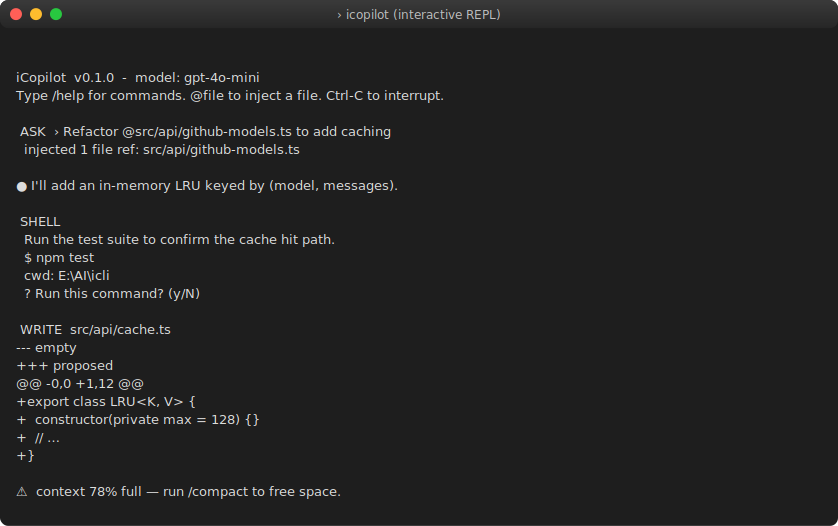
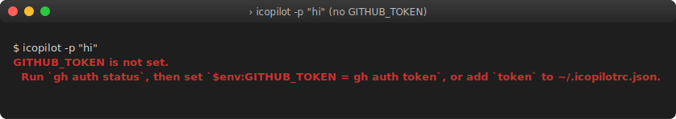
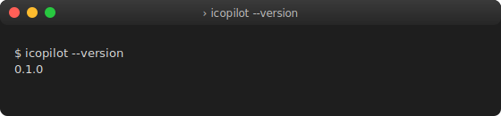

# iCopilot

A terminal-native, agentic CLI assistant — fully replicating and enhancing
the modern GitHub Copilot CLI experience, powered exclusively by the
**GitHub Models API**.

**Version 2.0** — The Complete Agentic OS.

<p align="center">
  
</p>

## Features

### Core Experience
- 🗣️  **Interactive REPL** with live, streaming markdown responses
- 🧭  **Plan Mode** — produces step lists for review before any change
- ⚡  **One-shot mode** — `icopilot -p "..."` for scripting / piping
- 📎  **`@file` references** auto-inject file contents into context
- 🛠️  **Agentic tools** — shell + file edits gated by `[Y/n]` confirmation
- 🧠  **Token budget** tracker with auto-suggest `/compact`
- 💾  **Session persistence** — resume via `/sessions`
- 🪶  **Graceful SIGINT** — Ctrl-C aborts a stream, never the app
- 🔁  **HTTP 429 backoff** with cooldown banners

### Multi-Agent Orchestration (v1.4)
- 🤖  **Parallel agent runner** — concurrent sub-agent execution with `&` syntax
- 🧩  **Custom agent definitions** — `.icopilot/agents/*.yaml`
- 🎯  **Agent routing** — automatic delegation by query type
- 🔄  **Tool retry logic** — automatic retry on transient failures

### Copilot Spaces & Teams (v1.5)
- 📦  **Project spaces** — isolated context sandboxes per project/branch
- 🤝  **Session handoff** — export state for another developer
- 🧠  **Team memory** — shared `.icopilot/team-memory.md`
- 📂  **Smart file selection** — model-driven relevant file picking
- 🌿  **Git-aware context** — auto-include recently modified files

### IDE-Grade Intelligence (v1.6)
- 🔍  **Symbol index** — project-wide function/class/type table
- 🧭  **Cross-file navigation** — go-to-definition, find-references
- ✏️  **Multi-file atomic edits** — N-file changes reviewed holistically
- 🧪  **Code generation with tests** — auto-generate test file for new modules
- 👁️  **Live error watching** — monitor build output, auto-suggest fixes
- 🕵️  **Stack trace analysis** — AI-powered root cause diagnosis

### Workflow Automation (v1.7)
- ⚙️  **Workflow engine** — `.icopilot/workflows/*.yaml` with conditionals and loops
- 🚀  **GitHub Actions helper** — generate CI YAML from natural language
- 🪝  **Pre-commit hook** — `/review` + `/security` before commit
- 📁  **File watch triggers** — run workflow on file change
- 📦  **Release automation** — version bump → changelog → tag → publish

### Knowledge & Learning (v1.8)
- 📚  **Project RAG** — chunk and index all docs for retrieval
- 📝  **Doc generation** — JSDoc/docstring from code
- 📖  **README generation** — scaffold from project analysis
- 🏗️  **Architecture diagrams** — mermaid from code relationships
- 🎨  **Style learning** — adapt to user's coding patterns
- 💡  **Correction memory** — remember and apply user corrections
- 📏  **Project conventions** — learn and enforce patterns

### Enterprise & Security (v1.9)
- 🔐  **Role-based access** — restrict tools by user role
- 📋  **Audit logging** — full trail of all tool executions
- 🌐  **Proxy support** — HTTP/HTTPS/SOCKS5
- 🏠  **Air-gapped mode** — local models (Ollama, vLLM)
- 🛡️  **Content filtering** — prevent PII in prompts
- 🗑️  **Retention policies** — auto-delete after N days

### The Complete Agentic OS (v2.0)
- 🎯  **Goal-driven development** — describe feature → implement end-to-end
- 🔧  **Self-healing builds** — detect failure → diagnose → fix → retry
- 🧪  **TDD agent** — write tests first, implement until green
- 🌐  **Multi-repo orchestration** — coordinate across repositories
- 🏪  **Plugin marketplace** — `icopilot install <plugin>`
- 🔌  **Custom model providers** — any OpenAI-compatible endpoint
- 🖥️  **IDE bridge** — bidirectional VS Code / Neovim communication
- 🌍  **API server mode** — expose as HTTP API (`--serve`)
- 🐳  **Container sandbox** — Docker-based isolated execution
- ☁️  **Cloud sessions** — run in cloud, access from any terminal

### Slash Commands

```
/help /clear /model /cwd /diff /context /compact /sessions /export
/commit /pr /review /issue /branch /plan /lint /test /security
/agent /space /workflow /actions /release /doc /readme /diagram
/rag /conventions /corrections /audit /proxy /provider /goal /heal
/tdd /repo /serve /exit
```

## Install

```bash
npm install
npm run build
npm link        # exposes `icopilot` / `icli` globally
```

## Auth

Set a GitHub PAT with `models:read`:

```bash
# bash / zsh
export GITHUB_TOKEN=ghp_xxx...

# PowerShell
$env:GITHUB_TOKEN = "ghp_xxx..."
```

Optional:

```bash
ICOPILOT_MODEL=gpt-4o          # default model
ICOPILOT_ENDPOINT=https://models.inference.ai.azure.com
```

## Usage

```bash
icopilot                                   # interactive REPL
icopilot -p "Explain @src/index.ts"        # one-shot
icopilot --model gpt-4o                    # pin model
icopilot --plan                            # start in plan mode
icopilot --sandbox                         # restrict tools to cwd
icopilot --local                           # use local model (Ollama)
icopilot --provider my-provider            # custom model provider
icopilot --serve 3000                      # start as HTTP API server
icopilot --verbose --log-level debug       # structured logs to stderr
icopilot --theme light                     # light / dark / none
```

<p align="center">
  
</p>

See [`docs/config.md`](./docs/config.md) for the full config-file format,
[`docs/sessions.md`](./docs/sessions.md) for session/memory usage, and
[`docs/mcp.md`](./docs/mcp.md) for MCP server integration.

Inside the REPL:

```
> /help
> /model gpt-4o-mini
> Refactor @src/api/github-models.ts to add caching
> /goal "Add user authentication"
> /heal
> /tdd "Create a rate limiter"
> /review
> /commit
> /pr
> /sessions
> /export md
> /exit
```

### When something goes wrong

Errors are classified and re-rendered with actionable hints. For example,
running without a token:

<p align="center">
  
</p>

### Version

<p align="center">
  
</p>

> **About the screenshots.** They are deterministic SVG renderings of the
> actual binary's output (ANSI colors preserved). Regenerate them after any
> UX change with `npm run screenshots`.

## Architecture

```
src/
├── index.ts              # entry / CLI flag parsing
├── config.ts             # env + rc-file + runtime config
├── logger.ts             # structured logging + secret redaction
├── api/github-models.ts  # OpenAI-SDK client → GitHub Models
├── session/              # history, persistence, multi-session, cloud sessions, handoff
├── context/              # @file parser, /compact, project memory, smart files, git/dep context
├── tools/                # shell, file ops, apply_patch, grep, glob, multi-edit, retry, policy
├── mcp/                  # Model Context Protocol client + loader
├── commands/             # slash dispatcher, git autopilot, 40+ commands
├── agents/               # parallel runner, router, goal-driven, TDD, self-heal, multi-repo
├── intelligence/         # symbol index, navigation, error watch, stack trace, dead code
├── workflows/            # engine, file triggers, built-in workflows
├── knowledge/            # RAG, style learner, corrections, conventions
├── security/             # RBAC, audit, content filter, retention, proxy
├── providers/            # custom model providers, local models
├── plugins/              # marketplace, plugin loader
├── server/               # HTTP API server mode
├── bridge/               # IDE bridge (VS Code, Neovim)
├── sandbox/              # container-based execution
├── spaces/               # project spaces, space config
├── hooks/                # precommit, git hooks
├── ui/                   # streaming markdown render, theme, prompt
└── modes/                # interactive / plan / oneshot
```

See [`roadmap.md`](./roadmap.md) for the version plan, [`TODO.md`](./TODO.md)
for the implementation checklist, and [`CHANGELOG.md`](./CHANGELOG.md) for
release notes.

## License

MIT
